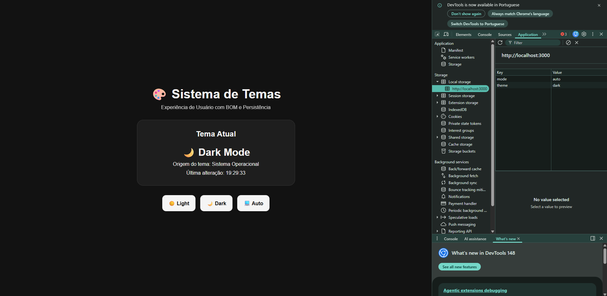
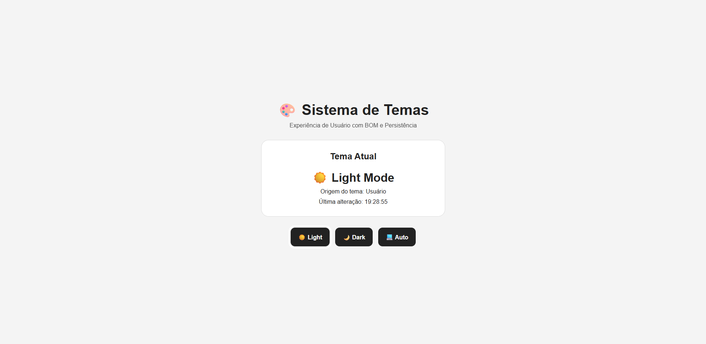
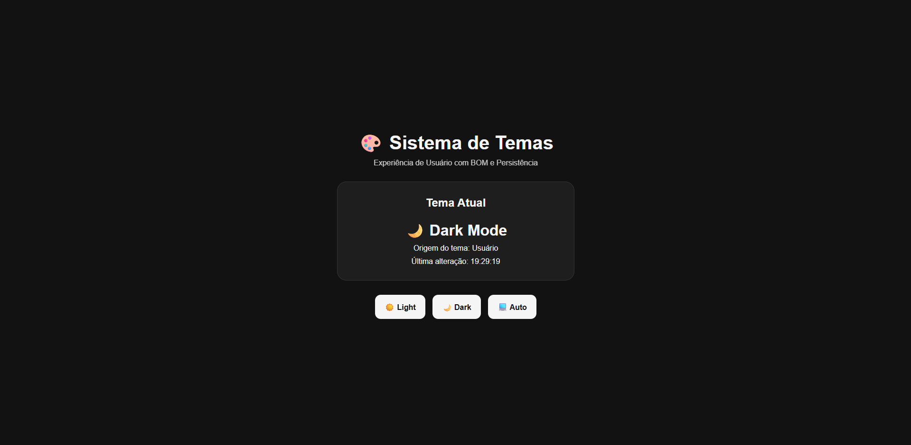
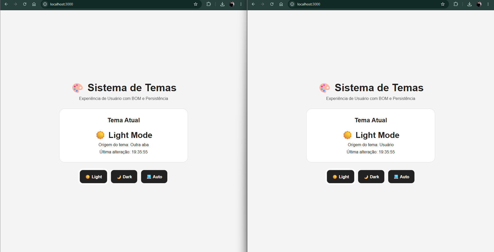

# Sistema de Temas - Dark/Light Mode

Projeto da disciplina de Desenvolvimento Web sobre BOM e persistência com localStorage.

Feito por: Kaue Almeida, Luccas Eduardo e Philip Kazuhiro

---

## O que o projeto faz

É um sistema de preferência de tema (dark/light) que salva a escolha do usuário no navegador e sincroniza entre abas abertas em tempo real. Também detecta automaticamente o tema do sistema operacional.

Funcionalidades:
- Salva o tema no `localStorage` (persiste mesmo fechando o navegador)
- Transição suave entre os temas via CSS
- Modo automático que segue o tema do SO (`prefers-color-scheme`)
- Sincronização entre abas usando o evento `storage`
- Botão com indicador visual do modo ativo

---

## Como rodar

Precisa ter o Node.js instalado.

```bash
# entra na pasta do projeto
cd p1_frontend

# sobe o servidor
node server.js
```

Depois é só abrir o navegador em `http://localhost:3000`

---

## Como testar cada funcionalidade

### Persistência entre sessões

1. Abre o projeto no navegador
2. Clica em Dark Mode
3. Fecha o navegador completamente
4. Abre de novo no `http://localhost:3000`
5. O dark mode deve continuar ativo

Pra confirmar, abre o DevTools (F12) → Application → Local Storage → http://localhost:3000 e vai ver as chaves `mode` e `theme` salvas lá.



---

### Transições suaves

Clica alternando entre Light e Dark e dá pra ver a animação de 0.5s acontecendo. O segredo tá no CSS:

```css
body {
    transition: background-color 0.5s ease, color 0.5s ease;
}
```




---

### Modo automático (sync com o SO)

1. Clica em Auto
2. Muda o tema do seu sistema operacional
   - Windows: Configurações → Personalização → Cores
   - macOS: Preferências do Sistema → Geral
3. O tema da página muda sozinho, sem recarregar

---

### Sincronização entre abas

1. Abre o projeto em duas janelas lado a lado
2. Muda o tema numa delas
3. A outra atualiza automaticamente e mostra "Origem do tema: Outra aba"

Isso funciona por causa do evento `storage` do JavaScript, que dispara em todas as abas menos na que fez a mudança.



---

## Tecnologias usadas

- HTML5, CSS3, JavaScript puro
- Node.js (só pra servir os arquivos localmente)
- Web Storage API (localStorage)
- BOM (window.matchMedia, evento storage)
